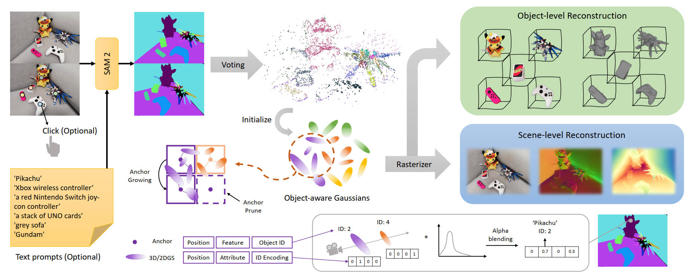

<h3 align="center"><strong>ObjectGS: Object-aware Scene Reconstruction and Scene Understanding via Gaussian Splatting</strong></h3>

<p align="center">
  <a href="https://ruijiezhu94.github.io/ruijiezhu/">Ruijie Zhu</a><sup>1,2</sup>,</span>
  <a href="https://mulinyu.github.io/">Mulin Yu</a><sup>2</sup>,</span>
  <a href="https://eveneveno.github.io/lnxu">Linning Xu</a><sup>3</sup>,</span>
  <a href="https://jianglh-whu.github.io/">Lihan Jiang</a><sup>1,2</sup>,</span>
  <a href="https://yixuanli98.github.io/">Yixuan Li</a><sup>3</sup>,</span><br> 
  <a href="https://staff.ustc.edu.cn/~tzzhang/">Tianzhu Zhang</a><sup>1</sup>,</span>
  <a href="https://oceanpang.github.io/">Jiangmiao Pang</a><sup>2</sup>,</span>
  <a href="https://daibo.info/">Bo Dai</a><sup>4</sup></span>
  <br>
  <sup>1</sup> USTC </span> 
  <sup>2</sup> Shanghai AI Lab </span> 
  <sup>3</sup> CUHK </span> 
  <sup>4</sup> HKU </span>
</p>

<div align="center">
  <a href='https://arxiv.org/abs/[]'></a> &nbsp;&nbsp;&nbsp;&nbsp;&nbsp;
  <a href='https://ruijiezhu94.github.io/ObjectGS_page/'></a> &nbsp;&nbsp;&nbsp;&nbsp;&nbsp;
  <a href='https://ruijiezhu94.github.io/ObjectGS_page/'></a> &nbsp;&nbsp;&nbsp;&nbsp;&nbsp; 
  <a href='https://github.com/RuijieZhu94/ObjectGS?tab=MIT-1-ov-file'></a> &nbsp;&nbsp;&nbsp;&nbsp;&nbsp;
  <a href='https://ruijiezhu94.github.io/ObjectGS'></a>
  <br>
  <br>
</div>

<br>

<p align="center">

</p>

> The overall architecture of ObjectGS. We first use a 2D segmentation pipeline to assign object ID and lift it to 3D. Then we initialize the anchors and use them to generate object-aware neural Gaussians. To provide semantic guidance, we model the Gaussian semantics and construct classification-based constraints. As a result, our method enables both object-level and scene-level reconstruction.

> **TODO: The full code might be released in several months. Stay tuned!**

### 📜 Citation

If you find our work useful, please cite:

```bibtex

```

### 🤝 Acknowledgements
Our code is based on [Scaffold-GS](https://city-super.github.io/scaffold-gs/), [HorizonGS](https://city-super.github.io/horizon-gs/), [GSplat](https://github.com/nerfstudio-project/gsplat) and [Gaussian-Grouping](https://github.com/lkeab/gaussian-grouping). We thank the authors for their excellent work!

